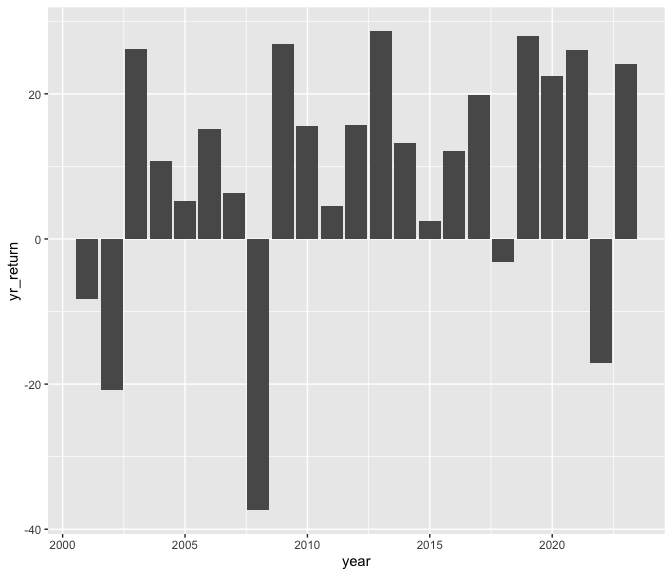

DSE3101_Week2
================
Tiffany
2024-01-24

- [Read the file into R](#read-the-file-into-r)
- [Statistics on S&P Prices](#statistics-on-sp-prices)
- [Plot of S&P Prices](#plot-of-sp-prices)
- [Plot of Total Yearly Returns of S&P from 2001 to
  2023](#plot-of-total-yearly-returns-of-sp-from-2001-to-2023)

## Read the file into R

``` r
df <- readRDS("data/wk2_stocks.rds")
str(df)
```

    ## 'data.frame':    5798 obs. of  4 variables:
    ##  $ SPY_prices : num  88.1 87.1 84.3 84.9 84.7 ...
    ##  $ SPY_returns: num  0.04804 -0.01076 -0.03264 0.00774 -0.00264 ...
    ##  $ SPY_vol    : num  88.1 87.1 84.3 84.9 84.7 ...
    ##  $ date       : Date, format: "2001-01-03" "2001-01-04" ...

## Statistics on S&P Prices

- The cumulative returns of the S&P index during this period is 218.33%

- The average daily retuns of the S&P index during this period is 0.04%

- The standard deviation of the daily returns of the S&P index during
  this period is 1.22%

## Plot of S&P Prices

``` r
library(tidyverse)
ggplot(data=df, aes(x=date, y=SPY_prices)) +
  geom_line()
```

<!-- -->

## Plot of Total Yearly Returns of S&P from 2001 to 2023

``` r
df %>%
  mutate(year = year(date)) %>%
  filter(year <= 2023) %>%
  group_by(year) %>%
  summarize(yr_return = sum (SPY_returns)*100)%>%
  ggplot(aes(x=year, y=yr_return)) +
  geom_col()
```

<!-- -->
